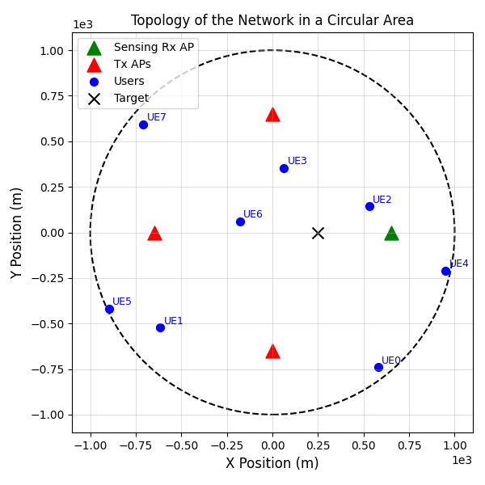

# Distributed Cell-Free ISAC: Coordinated Decentralized Resource Optimization

This repository contains the Python-based simulation framework for algorithms proposed in our research paper:

**Coordinated Decentralized Resource Optimization for Cell-Free ISAC Systems**.

## Introduction

Integrated Sensing and Communication (ISAC) has emerged as a key enabling technology for future 6G wireless networks, offering simultaneous data transmission and environmental sensing capabilities.
This repository provides simulation environments and optimization algorithms for coordinated decentralized resource allocation in cell-free ISAC networks.
Specifically, we introduce two key algorithms from our research:

- **SplitOpt**: Designing fixed beamformers locally at access points (APs) based on predefined methods, and solving a global PA problem centrally at the CS with minimal network-level coordination.
- **JointOpt**: A joint optimization strategy solving beamforming and power allocation simultaneously using decentralized consensus ADMM, optimizing resource utilization at the expense of increased computational complexity.

The algorithms aim to balance sensing accuracy (SNR) and communication reliability (SINR), offering flexible coordination for decentralized wireless network architectures.

## Algorithms Implemented

### SplitOpt

- **Description**: SplitOpt defines power splitting ratios (PSRs) between communication and sensing, computes local modified regularized zero-forcing (LM-RZF) beamformers for communication users and null-space conjugate (NS-C) for sensing targets locally at each AP, and solves an optimization problem using projected gradiend ascent to optimize PSRs.
### JointOpt

- **Description**: JointOpt simultaneously optimizes beamforming vectors and power allocation ratios via consensus Alternating Direction Method of Multipliers (ADMM). APs collaboratively achieve global optimization through local computations and minimal consensus message passing, providing resource efficiency at moderate complexity.

## Repository Structure

```
distributed-cellfree-isac/
├── src/
│   ├── utils/              # Utility functions and simulation classes
│   └── simulations/        # Simulation setups and execution scripts
│       └──  your_code.py   # Your simulation code
├── results/                # Directory to store simulation outputs
│   ├── exp1/               # Results for SplitOpt algorithm
│   │   ├── data/           # Data files for SplitOpt simulation
│   │   └── figures/        # Figures generated from SplitOpt simulation
│   └── exp2/               # Results for JointOpt algorithm
│       ├── data/           # Data files for JointOpt simulation
│       └── figures/        # Figures generated from JointOpt simulation
├── notebooks/              # Jupyter notebooks for analysis and visualization
├── LICENSE                 # License file
├── requirements.txt        # Python dependencies
└── README.md               # Repository overview
```

## Quickstart

### Setup
Clone the repository and install dependencies:

```bash
git clone https://github.com/mehdizd97/distributed-cellfree-isac.git
cd distributed-cellfree-isac
pip install -r requirements.txt
```

### Running Simulations
Add your code in a python file under `src/simulations/` and run the simulation scripts.
Below are examples of how to write scripts to run the SplitOpt and JointOpt simulations.

```bash
params = SimulationParameters(N_ap=4, N_ue=8, M_t=10, TxSNR=20, seed=None)
sim = WirelessSimulation(params)
sim.generate_topology()
sim.plot_topology()
```

[//]: # (![System Model]&#40;results/exp1/figures/exp1_topology.png&#41;)
<p align="center">
  
</p>

#### SplitOpt Simulation
```bash
sim.set_splitOpt_params(gamma, min_rho, max_rho, xi, Psi, max_iters)
sim.run_simulation(optimizePA=True)
```

#### JointOpt Simulation
```bash
sim.set_jointOpt_params(lambda_, rho, eta_share, xi_slack, sca_iters, admm_iters)
sim.run_simulation_jointOpt()
```

**Output Parameters:**

- `sim.outputs.comm_user_sinr`: SINR for all users in dB.
- `sim.outputs.comm_avg_sinr`: Average SINR in dB.
- `sim.outputs.sens_total_snr`: Total sensing SNR in dB.
- `sim.outputs.sens_only_snr`: Sensing beam SNR in dB.
- `sim.outputs.splitOpt_history`: History of SplitOpt algorithm.
- `sim.outputs.jointOpt_history`: History of JointOpt algorithm.

## Citation

If you use this repository in your research, please cite:

### Paper
```bibtex
@inproceedings{zafari2025paper,
  author = {Mehdi Zafari and Rang Liu and A. Lee Swindlehurst},
  title = {Coordinated Decentralized Resource Optimization for Cell-Free ISAC Systems},
  booktitle = {IEEE Asilomar Conference on Signals, Systems, and Computers},
  year = {2025},
  month = {October},
  note = {accepted for publication}
}
```

### Code/Repository
```bibtex
@misc{zafari2025distributedcellfreeisac,
  author = {Mehdi Zafari},
  title = {Distributed Cell-Free ISAC Simulation Framework},
  year = {2025},
  howpublished = {GitHub repository},
  url = {https://github.com/mehdizd97/distributed-cellfree-isac},
  note = {Version 1.0.0}
}
```

**Note:** This repository and associated algorithms are part of ongoing research. Final results and additional updates will be provided upon publication acceptance.

